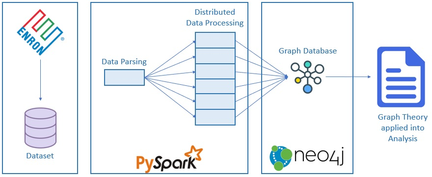

# Enron-pyspark-analysis
A spark application that retrieves content from Enron's mail dataset and builds a Neo4j graph with some social network measurements

# The Project
Our goal is to take the enron emails dataset, made available after the company bankruptcy in 2002, analyze it using big-data tools and get some relevant social network insight, such as degree, betweenness, and pagerank from all of the email adresses within the dataset. The idea of using big-data tools is to make the project scalable for running in multiple clusters in order to be able to process the whole Enron data (and possibly even larger datasets with similar data format).

The core of this project could be potentially used to analyze other mail datasets, such as your companies' mail record, as long as the employees emails are tagged into an XML file with to and from fields tagged accordingly. 

The schema below presents the basic architecture of the project, from the raw dataset to the final report. The dataset was made available by the company in multiple files, because of the big amount of data, due to this everything had to be parsed to retrieve the information needed from the entire dataset. With the necessary data extracted from the dataset, we use a distributed method to better process the data into a graph database model.

 

Turn the dataset into a Graph Database allow us to use the methodology of [Graph Theory](https://en.wikipedia.org/wiki/Graph_theory) to analyze our data.

### Tools used
For this project, we used:
* The enron-v2 dataset made available from this link: https://archive.org/details/edrm.enron.email.data.set.v2.xml (only the individual zip files of each employee);
* Apache Spark through pyspark library for python to create and manage RDDs;
* Neo4j graph database platform and neo4j.v1 and py2neo python libraries.

### Methodology
To achieve the final result, an analysis of the Enron's internal social network, the raw data went through the process listed below:

#### Step 1 - Extracting the data:
The first part of this project is to get all of the Enron dataset, which is composed of multiple .zip files, one for each Enron employee, containing all emails and its attachments (media such as audio, documens and photos), as well as a XML file tagging every email and its 'to' and 'from' information, which is the most important part of the dataset and the one we're looking into in order to build the companhies social graph. Once having access to these zipped files, we unzip the XML file that has the needed data and store it for further parsing.

#### Step 2 - Parsing the XML and Building the first RDD:
After getting the XML files of each employee, we inserted all of the xml filenames into an RDD for the sake of making the whole process scalable. We then need to parse the tags of the XMLs containing 'to' and 'from' to get all of the email adressses and its connections. We do this by iterating through every 'Document' tag (that holds all of the info of a single email) and use regular expression statements to refine the results. 

#### Step 3 - operating the RDDs:
Doing a map operation in the XML RDD with the above mentioned process will create a new RDD made of the following structure:
* (from email address, to email address)
That structure means that an email has been sent between these two addressess.

Doing a reduceByKey that sums every identical connection will provide us with another RDD containing:
* ((from email address, to email address), frequency)
In which frequency means the number of emails that this source sent to this target.

#### Step 4 - getting the data ready to build the graph
Since we are using Neo4J database to store our social network graph, a data format treatment is required to ensure successful insertion of the data into Neo4J with python connectors and Neo4j's query language restrictions.

First, a DataFrame object is created from the RDD (that pyspark does natively) that represent the node structure, with an id and the name (email), after all, our nodes of the social network represents an email address. The code is made to guarantee that each unique email address is extracted from the previous RDD structure into the node dataframe. Similarly, another DataFrame is built to store edge information with tags "src", "dst" and "weight" that represent from email address, to email address and number of emails, respectively.

Last, both Dataframes are exported to CSV files, of which the Neo4J query uses to generate nodes and edges

#### Step 5 - Generating the Graph:

The Neo4j system allows us to import directly a .csv file by command line, so utilizing [python-neo4j driver](https://neo4j.com/developer/python/), we start a connection with neo4j in the main.py file to execute Neo4j commands in our script. The main communication with Neo4j is executed by queries, so first, we load the .csv file to create our nodes and edges.

For example, here is the query used to create the nodes: 

"""
    LOAD CSV WITH HEADERS FROM "file:///nodes/"""+node_csv_name+"""" AS csvLine
    CREATE (e:Employee {username: csvLine.name})
"""

Take into consideration the way our .csv is built, because in the query we ask to read the file with headers, so it can identify the different columns in the file. 

### Step 6 - Graph Analysis

### Installing and running (local mode)

In order to use this script, the following requirements are needed:

* A Linux distro OS;
* Python3 (usually comes by default with some linux distributions);
* Spark release 2.2.0 - Download on this link (https://spark.apache.org/downloads.html);

Install spark on whichever folder you prefer. Just remember the path as you have to access it later.

* install pyspark connector:

```
$ sudo pip install pyspark
```


* Install Neo4j APIs Py2Neo and Neo4j.v1 
```
$ sudo pip install neo4j-driver
$ sudo pip install pip install py2neo
```

The main.py file is responsible for:
* Extracting all the xml files from each employees mail dataset zip folder and place it on a temporary folder;
* Parsing the xml files to get all the pairs to-from of each email (it permutates if there is more than one to recipient) and store this information on an RDD;
* Create two separate RDDs with the vertices(email adresses) and edges(emails) obtained from previous RDD;
* Writing the RDDs informations in two CSV files;
* Building a Neo4J database with the RDD information (a query loads both csv files to create the vertices and edges of the graph). 

The analise.py file is responsible for:
* Retrieving the Neo4J database and calculating degree, weighted degree, betweenness and pagerank values for the graph.


#
* 
